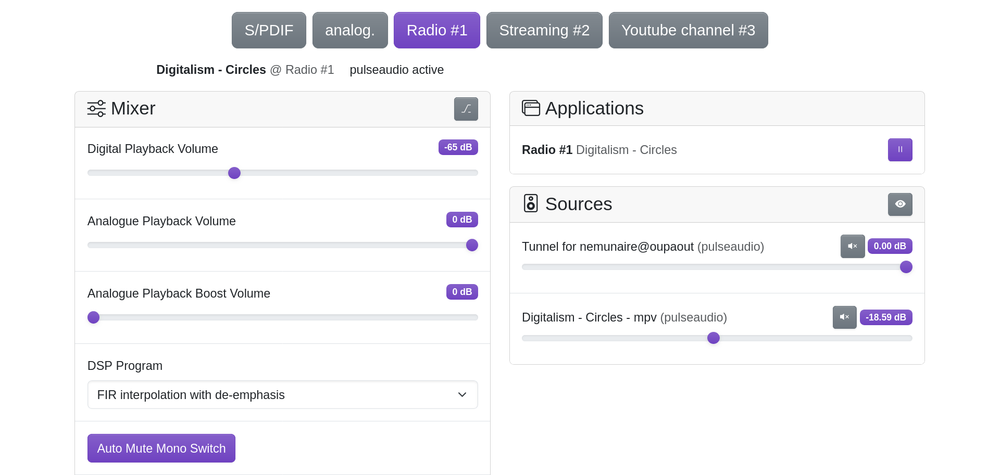

<a name="readme-top"></a>

<div align="center">

# hathoris

Simple, open-source, web interface & API for controlling your HiFi amplifier on Linux.

</div>

<div align="center"><h4><a href="#about-the-project">About the Project</a> • <a href="#goals-and-features">Goals and Features</a>  • <a href="#setup">Setup</a> • <a href="#configuration-and-usage">Configuration and Usage</a> • <a href="#compatible-hardware">Compatible Hardware</a> • <a href="#stack-tech">Stack Tech</a> • <a href="#license-and-contributions">License and Contributions</a></h4></div>

<p align="center"></p>

## About the Project

Hathoris is a web interface and API for controlling an audio amplifier on Linux. It allows selecting audio sources, whether virtual (web radio, streaming, local or remote sources) or physical (S/PDIF, analog line-in, etc., depending on the hardware). It also provides advanced control over exposed sound card parameters, such as overall volume, stereo balance, and on some hardware, settings like treble, bass, and surround.


## Goals and Features

Hathoris aims to provide a simple and accessible solution for controlling a HiFi amplifier over the network. The key features include:

- **Easy sharing of HiFi equipment:** Allow multiple users in a household to control an amplifier over WiFi.

- **Seamless integration:** Restore the simplicity of old HiFi systems while modernizing control.

- **Support for multiple audio sources:** Handle both physical and virtual sources (S/PDIF input, ).

- **Sound card/amplifier controls:** Use your browser or the API to remotely change the volume or any other parameters exposed by the sound card.

- **Integration with multiple application:** Display the current track and/or control the underlying application (like [AirPlay](https://github.com/mikebrady/shairport-sync), [MPRIS2](https://mpris2.readthedocs.io/en/latest/) (Firefox, ...), [mpv](https://github.com/mpv-player/mpv), ...).

- **Per input volume control:** Thanks to `pulseaudio`, every sink-inputs can be mixed at a given volume.


## Setup

### Prerequisites

Hathoris is compatible with any Linux distribution that has PulseAudio. It also requires:

- `alsa-utils` is required to control sound card parameters, and to handle some physical sources.
- `mpv` and `yt-dlp` for managing virtual sources.
- A compatible amplifier or sound card (see the [Compatible Hardware](#compatible-hardware) section).


### Quick Installation Guide

#### With Docker

[Prepare a configuration for optional virtual inputs](#audio-sources) (like radios, streaming sources), create the file at `~/.config/hathoris/settings.json`.

```
docker run -p 8080:8080 \
  --device /dev/snd \
  -e PULSE_SERVER=unix:/run/pulse/native \
  -v ${XDG_RUNTIME_DIR}/pulse/native:/run/pulse/native \
  -v ~/.config/pulse/cookie:/root/.config/pulse/cookie \
  -v ~/.config/hathoris:/var/lib/hathoris \
  nemunaire/hathoris:1
```

⚠️ Please note that if your host is directly reachable on the Internet, it will be accessible to anyone who can reach this port. It is recommended to use a reverse proxy and/or configure proper firewall rules to secure your setup.

#### Without Docker

1. Install dependancies.

   - On Debian/Ubuntu/Raspbian/armbian/...: `sudo apt install alsa-utils pulseaudio-utils mpv yt-dlp`
   - On Alpine: `sudo apk add alsa-utils pulseaudio-utils mpv yt-dlp`
   - On ArchLinux/Manjaro: `sudo pacman -S alsa-utils pulseaudio mpv yt-dlp`

2. Download the [latest release binary for your architecture](https://github.com/nemunaire/hathoris/releases/latest); choose between ARMv6 (Raspberry Pi Zero), ARMv7 (Voltastreams, Raspberry Pi 2+), ARM64 (Raspberry Pi Zero 2 and 3+ **with 64 bits OS**).

3. Give execution permissions: `chmod +x hathoris-linux-armv7`

4. (optional) [Prepare a configuration for optional virtual inputs](#audio-sources) (like radios, streaming sources)

   The file is called `settings.json`, it is expected to be in the directory where you execute `hathoris`. It can be overwrited by adding a command line argument like `-settings-file /etc/hathoris/settings.json`.

5. Launch the binary: `./hathoris -bind :8080`

6. The interface will be available on the port 8080 from anywhere on your local network.

   From your local machine, it'll be on <http://localhost:8080/>

⚠️ Please note that if your host is directly reachable on the Internet, it will be accessible to anyone who can reach this port. It is recommended to use a reverse proxy and/or configure proper firewall rules to secure your setup.

Enjoy!

### Build the Project

To build the project:


1. Clone the repository:

```
git clone https://github.com/nemunaire/hathoris.git
cd hathoris
```

2. Build the frontend:

```
cd ui
npm install
npm run build
cd ..
```

3. Then, build the API (which embed the frontend):

```
go build
```


## Configuration and Usage

### Audio Sources

- **Physical sources** are automatically detected when implemented in the code.
- **Application sources** like [shairport-sync](https://github.com/mikebrady/shairport-sync), a [pulseaudio/PipeWire tunnel](https://www.freedesktop.org/wiki/Software/PulseAudio/Documentation/User/Modules/#module-tunnel-sinksource), [Firefox/Chrome/VLC/... and others MPRIS2 compatible softwares](https://mpris2.readthedocs.io/en/latest/)....
- **Virtual sources** are configured via a JSON file. (A web configuration interface is planned.)

Here is an JSON with 2 virtual sources:

```json
{
  "custom_sources": [
    {
      "src": "mpv",
      "kv": {
        "file": "http://stream.syntheticfm.com:8040/stream",
        "name": "Radio Synthetic FM"
      }
    },
    {
      "src": "mpv",
      "kv": {
        "file": "https://youtube.com/channel/UCD-4g5w1h8xQpLaNS_ghU4g",
        "name": "NewRetroWave",
        "opts": [
          "--shuffle"
        ]
      }
    }
  ]
}
```

### API

The web interface talks directly to the REST API, so everything that can be perform in the browser can also be performed with the API.

The API is not yet documented, but a Swagger specification is planned soon.


#### Source Selection

Here is a basic API call to start listening what's received on the S/PDIF port of the amplifier:

```
curl -X POST http://127.0.0.1:8080/api/sources/spdif/enable
```

Select a virtual source, as defined earlier:

```
curl -X POST http://127.0.0.1:8080/api/sources/mpv-0/enable
```

When enabling one source, any other active source is disabled beforehand.


#### Volume Control

You can control the sound card volume (and any other parameter it exposes):

```
curl -X POST -d '[108]' http://127.0.0.1:8080/api/mixer/1/values
```

`1` corresponds to the ALSA `NumID`, given by `/api/mixer`:

```
curl http://127.0.0.1:8080/api/mixer'
[
  {
    "NumID": 1,
    "Name": "Digital Playback Volume",
    "Type": "INTEGER",
    "RW": true,
    "Min": 0,
    "Max": 207,
    "DBScale": {
      "Min": -103.5,
      "Step": 0.5,
      "Mute": 1
    },
    "values": [
      144,
      144
    ]
  },
  {
    "NumID": 2,
    "Name": "Analogue Playback Volume",
    "Type": "INTEGER",
    "RW": true,
    "Min": 0,
    "Max": 1,
    "DBScale": {
      "Min": -6,
      "Step": 6
    },
    "values": [
      1,
      1
    ]
  },
  {
    "NumID": 3,
    "Name": "Analogue Playback Boost Volume",
    "Type": "INTEGER",
    "RW": true,
    "Min": 0,
    "Max": 1,
    "DBScale": {
      "Min": 0,
      "Step": 0.8
    },
    "values": [
      1,
      1
    ]
  },
  {
    "NumID": 4,
    "Name": "Digital Playback Switch",
    "Type": "BOOLEAN",
    "RW": true,
    "Min": 0,
    "Max": 0,
    "values": [
      true,
      true
    ]
  },
  {
    "NumID": 5,
    "Name": "Deemphasis Switch",
    "Type": "BOOLEAN",
    "RW": true,
    "Min": 0,
    "Max": 0,
    "values": [
      true
    ]
  },
  {
    "NumID": 6,
    "Name": "DSP Program",
    "Type": "ENUMERATED",
    "RW": true,
    "Min": 0,
    "Max": 0,
    "values": [
      0
    ],
    "items": [
      "FIR interpolation with de-emphasis",
      "Low latency IIR with de-emphasis",
      "High attenuation with de-emphasis",
      "Fixed process flow",
      "Ringing-less low latency FIR"
    ]
  }
]
```

#### With Kodi

An companion script is available to control hathoris directly from Kodi:
<https://git.nemunai.re/nemunaire/kodi.script.hathoris>

You can also create a script to automaticaly enable your Kodi input when it lauches.
Eg. for LibreELEC, append in `~/.config/autostart.sh`:

```
curl 'http://192.168.0.42:8080/api/sources/spdif/enable' -X POST
```

## Compatible Hardware

Hathoris has been tested on several hardware configurations, including:

- [Voltastream AMP1](https://polyvection.com/news/flashback-how-voltastream-paved-our-way/)
- [Voltastream Zero](https://polyvection.com/news/flashback-how-voltastream-paved-our-way/)
- [Raspberry Pi with DigiAMP+](https://www.raspberrypi.com/products/digiamp-plus/)

Additional compatible hardware may be added in the future (don't hesitate to contribute).


## Stack Tech

- [![Go][Go-badge]][Go-url] - A statically typed, concurrent, and garbage collected language

[Go-badge]: https://img.shields.io/badge/Go-00ADD8?style=for-the-badge&logo=go
[Go-url]: https://go.dev/
- [![Svelte][Svelte-badge]][Svelte-url] - A high-performance reactive JavaScript UI library

[Svelte-badge]: https://img.shields.io/badge/Svelte-FF3E00?style=for-the-badge&logo=svelte
[Svelte-url]: https://svelte.dev/


## License and Contributions

This project is licensed under the [GNU Affero General Public License 3.0](https://www.gnu.org/licenses/agpl-3.0.html).

Contributions are welcome! The goal is to keep the project simple, efficient, and compatible with as much Linux hardware as possible.
